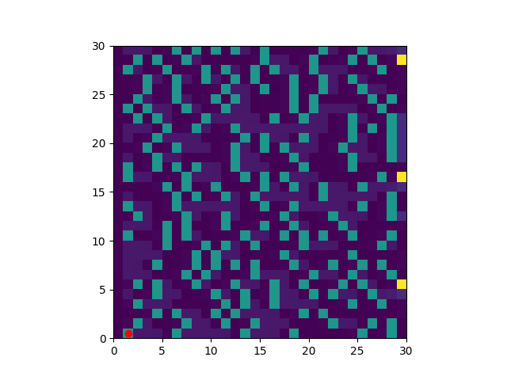

# ESE650_2026_Assignment1

## 2D Histogram Filter

To run the solution code and visualization:

	python3 histogram_filter_sol.py

## Example Visualization:

In the beginning the belief state can be visualized using `matplotlib.imshow()`

Over time the belief state should converge to the ground truth state:

